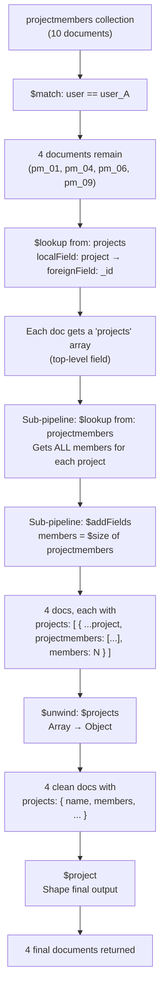

# MongoDB Aggregation Pipeline in `getProject` — Deep Dive

---

## Part 1: Why We Query `ProjectMember` Instead of `Project`

Before we jump into the pipeline mechanics, let's understand a fundamental design decision: **why does `getProject` start its aggregation from `ProjectMember` and not from `Project`?**

### The Problem

The goal of `getProject` is: **"Give me all the projects that the currently logged-in user is a part of."**

Now, look at the [Project model](file:///c:/Users/Ali%20Rizvi/Hai_projects/project-camp/src/models/project.model.js):

```js
// project.model.js
const projectSchema = new Schema({
  name:        { type: String, required: true, unique: true, trim: true },
  description: { type: String },
  createdBy:   { type: Schema.Types.ObjectId, ref: "User", required: true },
}, { timestamps: true });
```

The `Project` document only knows **who created it** (`createdBy`). It has **no idea** who its members are. There is no `members` array or any reference to users who have joined the project.

Now look at the [ProjectMember model](file:///c:/Users/Ali%20Rizvi/Hai_projects/project-camp/src/models/projectmember.model.js):

```js
// projectmember.model.js
const projectMemberSchema = new Schema({
  user:    { type: Schema.Types.ObjectId, ref: "User",    required: true },
  project: { type: Schema.Types.ObjectId, ref: "Project", required: true },
  role:    { type: String, enum: AvailableUser, default: UserRolesEnum.MEMBER },
}, { timestamps: true });
```

The `ProjectMember` document is the **bridge table** (junction table). It knows:
- **Which user** → `user` field
- **Which project** → `project` field
- **What role** → `role` field

### So Why Start from `ProjectMember`?

If we started from `Project`, we'd have to:
1. Fetch **all** projects from the database.
2. For each project, look up `ProjectMember` to see if `req.user._id` is in there.
3. Filter out the ones where the user isn't a member.

That's expensive and backwards. We'd be loading projects the user has nothing to do with.

Instead, by starting from `ProjectMember`:
1. We immediately `$match` on `user: req.user._id` — **instant filter**, only the rows where this user is a member.
2. From those rows, we already have the `project` ObjectIds.
3. We `$lookup` into `projects` to get the project details.

> [!TIP]
> **Think of it this way:** `ProjectMember` is the "index" that tells us which projects a user belongs to. We start from the index, not from the full table.

This is the classic pattern in any relational/document design where a **many-to-many** relationship is resolved through a junction/bridge collection. You always query from the side that has the filter condition (in this case, `user == req.user._id`).

---

## Part 2: Where Does `"projects"` and `"projectmembers"` Come From?

This is the core of your confusion, and it's a **very common** source of confusion for developers new to MongoDB.

### MongoDB's Automatic Collection Naming Convention

When you register a model in Mongoose like this:

```js
mongoose.model("Project", projectSchema);
```

Mongoose does **NOT** create a collection called `Project`. It applies a naming convention:

| What You Write | What Mongoose Creates in MongoDB |
|---|---|
| `mongoose.model("Project", ...)` | Collection: **`projects`** |
| `mongoose.model("ProjectMember", ...)` | Collection: **`projectmembers`** |
| `mongoose.model("User", ...)` | Collection: **`users`** |

**The rules are:**
1. **Lowercase** the model name
2. **Pluralize** it (add an "s", or handle irregular plurals)

So:
- `"Project"` → `"projects"`
- `"ProjectMember"` → `"projectmembers"`
- `"User"` → `"users"`

> [!IMPORTANT]
> **In `$lookup`, the `from` field expects the actual MongoDB collection name, NOT the Mongoose model name.** Mongoose's `.find()`, `.create()`, etc. abstract this away from you, but in raw aggregation pipelines, you're talking directly to MongoDB, so you must use the real collection name.

### Proof from Your Code

In [project.model.js](file:///c:/Users/Ali%20Rizvi/Hai_projects/project-camp/src/models/project.model.js#L26):
```js
export const Project = mongoose.model("Project", projectSchema);
//                                     ^^^^^^^^^ 
//                     Mongoose converts this to collection: "projects"
```

In [projectmember.model.js](file:///c:/Users/Ali%20Rizvi/Hai_projects/project-camp/src/models/projectmember.model.js#L27-L30):
```js
export const ProjectMember = mongoose.model("ProjectMember", projectMemberSchema);
//                                          ^^^^^^^^^^^^^^^^
//                           Mongoose converts this to collection: "projectmembers"
```

So when you see in the aggregation pipeline:
```js
$lookup: { from: "projects", ... }       // → talks to the "projects" collection (Project model)
$lookup: { from: "projectmembers", ... } // → talks to the "projectmembers" collection (ProjectMember model)
```

**It's not a field name. It's the actual MongoDB collection name that Mongoose auto-generated.**

> [!NOTE]
> You can override this default by passing a third argument to `mongoose.model()`:
> ```js
> mongoose.model("Project", projectSchema, "my_custom_collection_name");
> ```
> But since your code doesn't do this, the default pluralized-lowercase convention applies.

---

## Part 3: Why `$unwind: "$projects"` and NOT `$unwind: "$projectmembers"`?

This is the trickiest part and requires understanding **where each field lives** in the document at each stage.

### The Key Insight: Nesting

Look at the pipeline structure carefully:

```js
ProjectMember.aggregate([
  { $match: { user: ... } },           // Stage 1: filter ProjectMember docs
  { $lookup: {                          // Stage 2: OUTER lookup
      from: "projects",
      localField: "project",
      foreignField: "_id",
      as: "projects",                   // ← result goes HERE (top-level field)
      pipeline: [                       // ← SUB-PIPELINE (runs INSIDE the lookup)
        { $lookup: {                    //    Stage 2a: INNER lookup
            from: "projectmembers",
            localField: "_id",
            foreignField: "project",
            as: "projectmembers",       //    ← result goes HERE (nested inside each project)
        }},
        { $addFields: {                 //    Stage 2b
            members: { $size: "$projectmembers" }
        }},
      ],
  }},
  { $unwind: "$projects" },            // Stage 3: unwind the TOP-LEVEL array
  { $project: { ... } },               // Stage 4: shape the output
]);
```

After Stage 2, a single document looks like this:

```json
{
  "_id": "pm_1",
  "user": "user_A",
  "project": "proj_1",
  "role": "admin",
  "projects": [                          // ← THIS is the top-level array (from OUTER lookup)
    {
      "_id": "proj_1",
      "name": "Alpha",
      "description": "...",
      "createdBy": "user_A",
      "projectmembers": [               // ← THIS is nested INSIDE each project (from INNER lookup)
        { "_id": "pm_1", "user": "user_A", "project": "proj_1", "role": "admin" },
        { "_id": "pm_5", "user": "user_B", "project": "proj_1", "role": "member" }
      ],
      "members": 2                       // ← computed from $size of projectmembers
    }
  ]
}
```

**Notice the structure:**
- `"projects"` is a **top-level array** on the ProjectMember document.
- `"projectmembers"` is a **nested array inside each element of `projects`**.

When we `$unwind: "$projects"`, we're flattening the **top-level** `projects` array. After unwinding, the `projectmembers` data is still there — it's embedded inside each unwound project document.

> [!IMPORTANT]
> We don't need to `$unwind: "$projectmembers"` because we **never want to flatten** the members array — we only want to **count** them (via `$size`). The `$addFields: { members: { $size: "$projectmembers" } }` already extracted the count. The raw `projectmembers` array just stays nested (and could be excluded via `$project` if desired).

**If we tried `$unwind: "$projectmembers"` at the top level, it would FAIL** because `$projectmembers` doesn't exist as a top-level field — it's nested inside `$projects[0].projectmembers`.

---

## Part 4: Full Walkthrough with Dummy Data (10 docs → 4 final results)

### 🗄️ The Database State

We have 3 collections. Let's set up the data.

#### `users` collection (4 users)

| _id | username | email |
|-----|----------|-------|
| `user_A` | ali | ali@mail.com |
| `user_B` | sara | sara@mail.com |
| `user_C` | john | john@mail.com |
| `user_D` | emma | emma@mail.com |

#### `projects` collection (5 projects)

| _id | name | description | createdBy |
|-----|------|-------------|-----------|
| `proj_1` | Alpha | Frontend app | `user_A` |
| `proj_2` | Beta | Backend API | `user_B` |
| `proj_3` | Gamma | Mobile app | `user_A` |
| `proj_4` | Delta | DevOps infra | `user_C` |
| `proj_5` | Epsilon | ML pipeline | `user_D` |

#### `projectmembers` collection (10 documents)

| _id | user | project | role |
|-----|------|---------|------|
| `pm_01` | `user_A` | `proj_1` | admin |
| `pm_02` | `user_B` | `proj_1` | member |
| `pm_03` | `user_C` | `proj_1` | member |
| `pm_04` | `user_A` | `proj_2` | member |
| `pm_05` | `user_B` | `proj_2` | admin |
| `pm_06` | `user_A` | `proj_3` | admin |
| `pm_07` | `user_D` | `proj_3` | member |
| `pm_08` | `user_C` | `proj_4` | admin |
| `pm_09` | `user_A` | `proj_4` | member |
| `pm_10` | `user_D` | `proj_5` | admin |

**Our logged-in user is `user_A` (ali).** He is a member of projects: `proj_1`, `proj_2`, `proj_3`, `proj_4` → **4 projects**.

---

### Stage 0: Starting Collection

We call `ProjectMember.aggregate(...)`, so our **starting collection is `projectmembers`** (all 10 docs).

```
📁 Working Set: ALL 10 projectmember documents
```

---

### ⚙️ Stage 1: `$match` — Filter by Current User

```js
{ $match: { user: new mongoose.Types.ObjectId("user_A") } }
```

MongoDB scans the `projectmembers` collection and keeps only documents where `user == user_A`.

**Result: 4 documents remain (out of 10)**

```json
[
  { "_id": "pm_01", "user": "user_A", "project": "proj_1", "role": "admin"  },
  { "_id": "pm_04", "user": "user_A", "project": "proj_2", "role": "member" },
  { "_id": "pm_06", "user": "user_A", "project": "proj_3", "role": "admin"  },
  { "_id": "pm_09", "user": "user_A", "project": "proj_4", "role": "member" }
]
```

> [!NOTE]
> We went from 10 → 4 docs instantly. This is why starting from `ProjectMember` is efficient — we filter early.

---

### ⚙️ Stage 2: `$lookup` — Join with `projects` Collection (OUTER)

```js
{
  $lookup: {
    from: "projects",               // ← actual MongoDB collection name (from mongoose.model("Project"))
    localField: "project",          // ← field in current doc (projectmember.project)
    foreignField: "_id",            // ← field in projects collection (project._id)
    as: "projects",                 // ← name of the new array field to store results
    pipeline: [ ... ]               // ← sub-pipeline to run on each matched project
  }
}
```

**What happens under the hood:**

For **each** of the 4 documents, MongoDB:
1. Takes the `project` field value (e.g., `"proj_1"`)
2. Goes to the `projects` collection
3. Finds all documents where `_id == "proj_1"`
4. Runs the **sub-pipeline** on those matched documents
5. Stores the result in a new field called `"projects"` (an array)

> [!NOTE]
> **The `as: "projects"` is just a label.** You could call it `as: "banana"` and it would work — you'd just unwind `$banana` later. It has nothing to do with the collection name; it's the name of the new field being added to the current document.

#### Sub-Pipeline Stage 2a: INNER `$lookup` — Join with `projectmembers`

```js
{
  $lookup: {
    from: "projectmembers",        // ← actual MongoDB collection name
    localField: "_id",             // ← _id of the current project doc (e.g., "proj_1")
    foreignField: "project",       // ← field in projectmembers collection
    as: "projectmembers",          // ← name for the result array
  }
}
```

This runs **inside each matched project document**. For project `proj_1`, it goes back to `projectmembers` collection and finds ALL members of that project (not just user_A — ALL members).

#### Sub-Pipeline Stage 2b: `$addFields` — Count Members

```js
{
  $addFields: {
    members: { $size: "$projectmembers" }
  }
}
```

Adds a `members` field with the count of the `projectmembers` array.

---

**Let's trace Document 1 (`pm_01`) through Stage 2:**

**Input:**
```json
{ "_id": "pm_01", "user": "user_A", "project": "proj_1", "role": "admin" }
```

**Step 1:** OUTER lookup matches `project: "proj_1"` against `projects._id`. Finds:
```json
{ "_id": "proj_1", "name": "Alpha", "description": "Frontend app", "createdBy": "user_A" }
```

**Step 2:** Sub-pipeline runs on this matched project. INNER lookup finds all `projectmembers` where `project == "proj_1"`:
```json
[
  { "_id": "pm_01", "user": "user_A", "project": "proj_1", "role": "admin"  },
  { "_id": "pm_02", "user": "user_B", "project": "proj_1", "role": "member" },
  { "_id": "pm_03", "user": "user_C", "project": "proj_1", "role": "member" }
]
```

**Step 3:** `$addFields` computes `members: 3`

**Final result for pm_01 after Stage 2:**

```json
{
  "_id": "pm_01",
  "user": "user_A",
  "project": "proj_1",
  "role": "admin",
  "projects": [
    {
      "_id": "proj_1",
      "name": "Alpha",
      "description": "Frontend app",
      "createdBy": "user_A",
      "projectmembers": [
        { "_id": "pm_01", "user": "user_A", "project": "proj_1", "role": "admin"  },
        { "_id": "pm_02", "user": "user_B", "project": "proj_1", "role": "member" },
        { "_id": "pm_03", "user": "user_C", "project": "proj_1", "role": "member" }
      ],
      "members": 3
    }
  ]
}
```

---

**All 4 documents after Stage 2 (showing nested structure):**

````carousel
### Document 1 (pm_01) — Project Alpha

```json
{
  "_id": "pm_01",
  "user": "user_A",
  "project": "proj_1",
  "role": "admin",
  "projects": [
    {
      "_id": "proj_1",
      "name": "Alpha",
      "description": "Frontend app",
      "createdBy": "user_A",
      "projectmembers": [
        { "_id": "pm_01", "user": "user_A", "project": "proj_1", "role": "admin"  },
        { "_id": "pm_02", "user": "user_B", "project": "proj_1", "role": "member" },
        { "_id": "pm_03", "user": "user_C", "project": "proj_1", "role": "member" }
      ],
      "members": 3
    }
  ]
}
```
<!-- slide -->
### Document 2 (pm_04) — Project Beta

```json
{
  "_id": "pm_04",
  "user": "user_A",
  "project": "proj_2",
  "role": "member",
  "projects": [
    {
      "_id": "proj_2",
      "name": "Beta",
      "description": "Backend API",
      "createdBy": "user_B",
      "projectmembers": [
        { "_id": "pm_04", "user": "user_A", "project": "proj_2", "role": "member" },
        { "_id": "pm_05", "user": "user_B", "project": "proj_2", "role": "admin"  }
      ],
      "members": 2
    }
  ]
}
```
<!-- slide -->
### Document 3 (pm_06) — Project Gamma

```json
{
  "_id": "pm_06",
  "user": "user_A",
  "project": "proj_3",
  "role": "admin",
  "projects": [
    {
      "_id": "proj_3",
      "name": "Gamma",
      "description": "Mobile app",
      "createdBy": "user_A",
      "projectmembers": [
        { "_id": "pm_06", "user": "user_A", "project": "proj_3", "role": "admin"  },
        { "_id": "pm_07", "user": "user_D", "project": "proj_3", "role": "member" }
      ],
      "members": 2
    }
  ]
}
```
<!-- slide -->
### Document 4 (pm_09) — Project Delta

```json
{
  "_id": "pm_09",
  "user": "user_A",
  "project": "proj_4",
  "role": "member",
  "projects": [
    {
      "_id": "proj_4",
      "name": "Delta",
      "description": "DevOps infra",
      "createdBy": "user_C",
      "projectmembers": [
        { "_id": "pm_08", "user": "user_C", "project": "proj_4", "role": "admin"  },
        { "_id": "pm_09", "user": "user_A", "project": "proj_4", "role": "member" }
      ],
      "members": 2
    }
  ]
}
```
````

> [!IMPORTANT]
> **Notice the document shape!**
> - `projects` is a **top-level array** (added by the OUTER `$lookup`).
> - `projectmembers` is **nested inside each element of `projects`** (added by the INNER `$lookup` sub-pipeline).
> - `members` (the count) is also **nested inside each element of `projects`**.
>
> This nesting structure is **exactly why** we `$unwind: "$projects"` and NOT `$unwind: "$projectmembers"`. The field `projectmembers` doesn't exist at the top level!

---

### ⚙️ Stage 3: `$unwind: "$projects"` — Flatten the Array

```js
{ $unwind: "$projects" }
```

`$unwind` takes an array field and creates **one document per array element**. Since each of our `projects` arrays has exactly 1 element (because each `ProjectMember` doc references exactly one project), the unwind essentially **replaces the array with the single object inside it**.

**Before unwind (Document 1):**
```json
{
  "_id": "pm_01",
  "user": "user_A",
  "project": "proj_1",
  "role": "admin",
  "projects": [               // ← ARRAY with 1 element
    {
      "_id": "proj_1",
      "name": "Alpha",
      "description": "Frontend app",
      "createdBy": "user_A",
      "projectmembers": [ ... ],
      "members": 3
    }
  ]
}
```

**After unwind (Document 1):**
```json
{
  "_id": "pm_01",
  "user": "user_A",
  "project": "proj_1",
  "role": "admin",
  "projects": {                // ← NOW AN OBJECT (unwound)
    "_id": "proj_1",
    "name": "Alpha",
    "description": "Frontend app",
    "createdBy": "user_A",
    "projectmembers": [ ... ],
    "members": 3
  }
}
```

The **only change** is `"projects"` went from being an **array** `[ { ... } ]` to being a plain **object** `{ ... }`. All the nested data (`projectmembers`, `members`) is still intact inside it.

**All 4 documents after unwind:**

| Doc | _id | role | projects.name | projects.members | projects.projectmembers |
|-----|-----|------|---------------|------------------|------------------------|
| 1 | pm_01 | admin | Alpha | 3 | [user_A, user_B, user_C] |
| 2 | pm_04 | member | Beta | 2 | [user_A, user_B] |
| 3 | pm_06 | admin | Gamma | 2 | [user_A, user_D] |
| 4 | pm_09 | member | Delta | 2 | [user_C, user_A] |

> [!TIP]
> **Why unwind at all if each array only has 1 element?** Because without `$unwind`, `projects` is still an array `[{...}]`. The `$project` stage that follows references fields like `projects.name`, `projects.members`. With an array, you'd need `projects.0.name` or deal with array syntax. Unwinding converts it to a clean object, making the `$project` stage simpler and the output cleaner.

---

### ⚙️ Stage 4: `$project` — Shape the Output

> [!NOTE]
> You mentioned you don't need this explained, so I'll keep it brief.

```js
{
  $project: {
    _id: 1,
    name: 1,
    description: 1,
    members: 1,
    createdAt: 1,
    createdBy: 1,
    role: 1,
  }
}
```

This selects which fields to include in the final output. The `projectmembers` nested array is excluded (not listed), so the final output is clean.

---

### 🏁 Final Output: 4 Documents

```json
[
  {
    "_id": "pm_01",
    "role": "admin",
    "projects": {
      "name": "Alpha",
      "description": "Frontend app",
      "members": 3,
      "createdBy": "user_A",
      "createdAt": "2026-01-01T..."
    }
  },
  {
    "_id": "pm_04",
    "role": "member",
    "projects": {
      "name": "Beta",
      "description": "Backend API",
      "members": 2,
      "createdBy": "user_B",
      "createdAt": "2026-02-01T..."
    }
  },
  {
    "_id": "pm_06",
    "role": "admin",
    "projects": {
      "name": "Gamma",
      "description": "Mobile app",
      "members": 2,
      "createdBy": "user_A",
      "createdAt": "2026-03-01T..."
    }
  },
  {
    "_id": "pm_09",
    "role": "member",
    "projects": {
      "name": "Delta",
      "description": "DevOps infra",
      "members": 2,
      "createdBy": "user_C",
      "createdAt": "2026-04-01T..."
    }
  }
]
```

---

## Summary: Answering All Your Questions

### Q1: Where does `from: "projects"` come from?
**Mongoose auto-creates collection names** by lowercasing and pluralizing the model name. `mongoose.model("Project", ...)` → collection `"projects"`. The `from` field in `$lookup` refers to the **actual MongoDB collection name**, not a field name.

### Q2: Where does `from: "projectmembers"` come from?
Same rule. `mongoose.model("ProjectMember", ...)` → collection `"projectmembers"`.

### Q3: Since the last lookup result is `projectmembers`, why don't we `$unwind` that?
Because `projectmembers` is **not a top-level field**. It's **nested inside** the `projects` array. The document structure after Stage 2 is:
```
doc.projects[0].projectmembers  ← nested here
```
You can only `$unwind` top-level fields. `$projects` is the top-level array that needs flattening.

### Q4: How does unwinding `$projects` give us all the data including project members?
Because the project members data is **embedded inside** each element of the `projects` array. When you unwind `projects`, the nested `projectmembers` and `members` fields come along for the ride — they're part of the object. Unwinding doesn't remove nested data; it just converts the outer array into individual documents.

---

## Visual Flow Diagram


